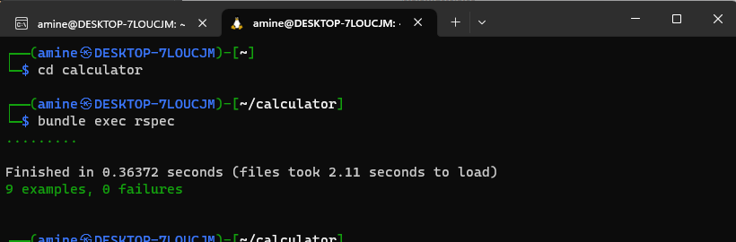

# Calculator Application

This is a simple calculator application built with Ruby on Rails that allows users to perform basic arithmetic calculations. It also keeps track of previous calculations, including the count and result of each calculation.
This calculator app uses Ajax to handle form submissions and operator button clicks without reloading the page. Here's how it works:

    When the user submits the form or clicks an operator button, an Ajax request is sent to the server.
    The server responds with a JavaScript code block, which is executed by the browser.
    The JavaScript code updates the DOM with the result of the calculation or displays an error message if there was a problem with the input.
    The user can continue to use the calculator without refreshing the page.

## Prerequisites

Before you can use this application, you need to have the following installed on your machine:

    Ruby
    Rails
    MongoDB

# Installation

## MongoDB

If you don't have MongoDB installed on your machine, you can download and install it from the official website:

    MongoDB Community Server

## Getting Started

To get started with the application, you should follow these steps:

    Clone the repository to your local machine using git clone.
    Install the required gems by running `bundle install.`
    Start the MongoDB service by running `sudo service mongod start.`
    To clean the MongoDB database used by your Rails application, you can use the following command: rake db:mongoid:purge
    Run the application using rails server.
    Open your web browser and navigate to http://localhost:3000.

## Using the Application

To use the application, follow these steps:

    Enter the first number in the Number 1 field.
    Enter the second number in the Number 2 field.
    If both numbers are between 0 and 100, the +, -, *, and / buttons will become enabled. If not, they will be disabled.
    Click on the desired operator button to perform the calculation.
    The result of the calculation will be displayed in green text, along with a success message. The calculation will also be added to the list of previous calculations.
    If an error occurs, such as division by zero or an invalid input, an error message will be displayed in red text.

## Architecture

The application is built with Ruby on Rails and MongoDB. The CalculatorController is responsible for handling all requests and responses, and the calculations collection in MongoDB is used to store the results of previous calculations.
Files and Directories

Here is a brief overview of the main files and directories in the application:

    app/controllers/calculator_controller.rb: This file contains the main logic for the application.
    app/views/calculator/index.html.erb: This file contains the HTML markup for the user interface.
    app/assets/stylesheets/application.css: This file contains the CSS styles used in the application.
    app/assets/javascripts/application.js: This file contains the JavaScript code used in the application.
    config/routes.rb: This file contains the routes used in the application.

## Testing

To run the tests for the application, follow these steps:

    Start the MongoDB service by running sudo service mongod start.
    Run the tests using bundle exec rspec.
    

